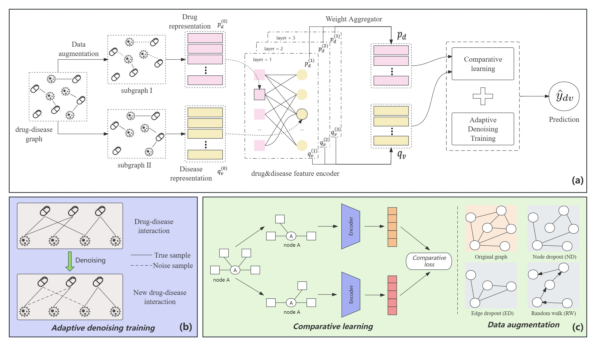

# SADR



This is the Python implementation of our paper "SADR: Debug repositioning based on self supervised graph learning".

>Sichen Jin, Yijia Zhang*, Huimin Yu, and Mingyu Lu


## Abstract

Traditional drug development is often high-risk and time-consuming. A promising alternative is to reuse or relocate approved drugs. Recently, some methods based on graph representation learning have started to be used for drug repositioning. These models learn the low dimensional embeddings of drug and disease nodes from the drug-disease interaction network to predict the potential association between drugs and diseases. However, these methods have strict requirements for the dataset, and if the dataset is sparse, the performance of these methods will be severely affected. At the same time, these methods have poor robustness to noise in the dataset. In response to the above challenges, we propose a drug repositioning model based on self-supervised graph learning with adptive denoising, called SADR. SADR uses data augmentation and contrastive learning strategies to learn feature representations of nodes, which can effectively solve the problems caused by sparse datasets. SADR includes an adaptive denoising training (ADT) component that can effectively identify noisy data during the training process and remove the impact of noise on the model. We have conducted comprehensive experiments on three datasets and have achieved better prediction accuracy compared to multiple baseline models. At the same time, we propose the top 10 new predictive approved drugs for treating two diseases. This demonstrates the ability of our model to identify potential drug candidates for disease indications.


## Environment Requirement

The code runs well under python 3.7. The required packages are as follows:

- pytorch == 1.7.1
- numpy == 1.20.3
- scipy == 1.7.1

## Quick Start
**Firstly**, you need to download the corresponding dataset, which can be downloaded from [here](https://github.com/luoyunan/DTINet) or [Baidu Cloud](https://pan.baidu.com/s/1Z82WaLBblt1_BjjMKWYzEw?pwd=k9fy). The extraction code is k9fy. Then place the downloaded dataset file in the dataset folder.


**Secondly**, change the value of variable *root_dir* and *data_dir* in *main.py*


Some important hyperparameters:

### DeepDR dataset
```
aug_type=ED
reg=1e-4
embed_size=64
n_layers=3
ssl_reg=0.1
ssl_ratio=0.1
ssl_temp=0.2
```

### DTI dataset
```
aug_type=ED
reg=1e-4
embed_size=64
n_layers=3
ssl_reg=0.5
ssl_ratio=0.1
ssl_temp=0.2
```

### CDataset dataset
```
aug_type=ED
reg=1e-3
embed_size=64
n_layers=3
ssl_reg=0.02
ssl_ratio=0.4
ssl_temp=0.5
```

**Finally**, run [main.py](./main.py) in IDE or with command line:

### DeepDR dataset
```bash
python main.py --recommender=SADR --dataset=DeepDR --aug_type=ED --reg=1e-4 --n_layers=3 --ssl_reg=0.1 --ssl_ratio=0.1 --ssl_temp=0.2
```

### DTI dataset
```bash
python main.py --recommender=SADR --dataset=DTI --aug_type=ED --reg=1e-4 --n_layers=3 --ssl_reg=0.5 --ssl_ratio=0.1 --ssl_temp=0.2
```

### CDataset dataset
```bash
python main.py --recommender=SADR --dataset=CDataset --aug_type=ED --reg=1e-3 --n_layers=3 --ssl_reg=0.02 --ssl_ratio=0.4 --ssl_temp=0.5
```

## Authors

**Sichen Jin** @github.com/Soar1998 \
**Email:** sichen_jin@dlmu.edu.cn \
**Site:** [GitHub](https://github.com/Soar1998)

**Yijia Zhang** @github.com/ItrecTextming \
**Email:** zhangyijia@dlmu.edu.cn \
**Site:** [GitHub](https://github.com/ItrecTextming)


## Acknowledgement

We refer to the code of [SGL](https://github.com/wujcan/SGL-Torch). Thanks for their contributions.